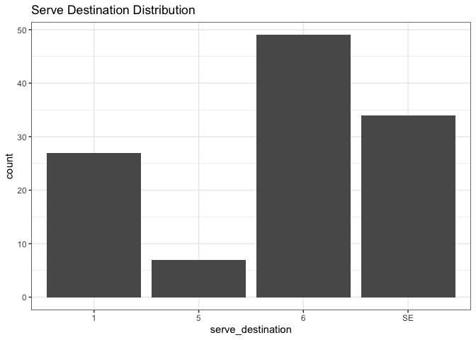
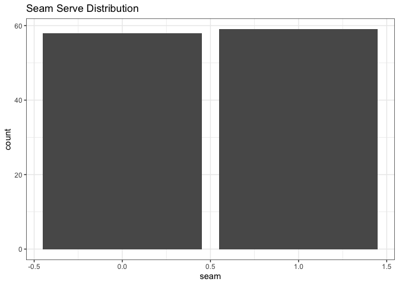
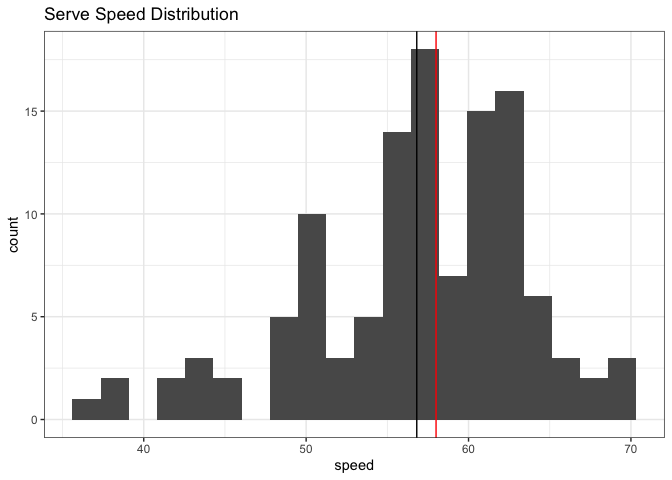
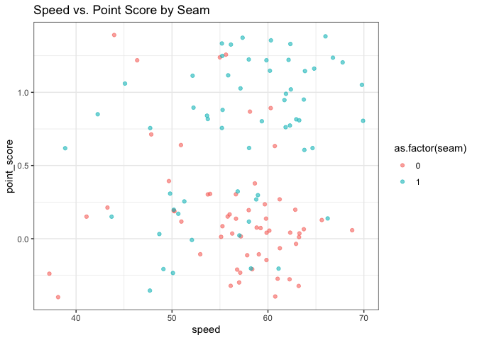
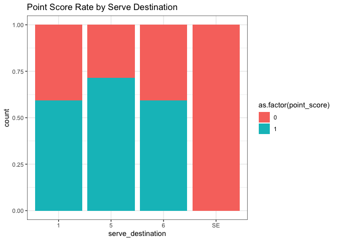
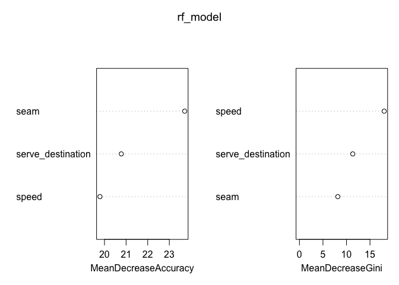
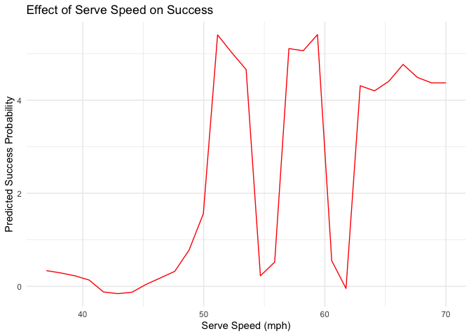
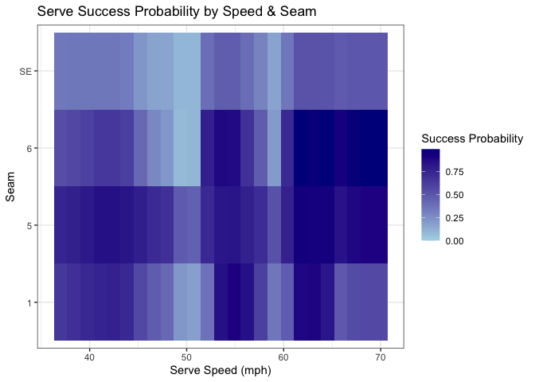

Serving Inquiry 2/25
================
Jeremiah Burden
2025-02-25

# Analyzing JC MVB Serving

## Preprocessing

``` r
pacman::p_load(tidyverse,ggrepel,rsample,caret,rattle,randomForest,pdp)
theme_set(theme_bw())

start_serve_data <- read_csv("/Users/jeremiahburden/Downloads/Volleyball/JCMVB Data/serving project/serve_data.csv")
```

    ## Rows: 5169 Columns: 19
    ## ── Column specification ────────────────────────────────────────────────────────
    ## Delimiter: ","
    ## chr   (5): opponent, match_type, server, serve_destination, opp_pass_rating
    ## dbl  (13): in_play, ace, error_bad, error_long, error, speed, serve_number, ...
    ## date  (1): date
    ## 
    ## ℹ Use `spec()` to retrieve the full column specification for this data.
    ## ℹ Specify the column types or set `show_col_types = FALSE` to quiet this message.

Over the last 3 seasons, Juniata Men’s Volleyball has collected over
5000 serves in order to improve our understanding of our serving
performance. In this analysis, we focus on one particular server, Tyler
Goldsborough, who has been our most effective server. Using data from
this season, we build a model of his performance.

While we collect 19 variables, we use 3 predictors. These are serve
characteristics that are more controllable and we feel we can provide
feedback on: the velocity in mph (`speed`), the zone the serve went to
(`serve_destination`), and whether or not the serve landed between the
passers (`seam`). These can be used to predict multiple responses, like
how well the opponent passes the serve or whether or not the serve was
an ace. Here, I choose to use whether or not we score the point
(`point_score`) as a binary target.

``` r
model_variables <- c("serve_destination","seam","speed","ace","point_score","xps")
serve_data <- start_serve_data %>% 
  filter(server=="Tyler G") %>% 
  filter(date > "2024-10-01") %>%
  filter(date < "2025-02-07") %>% 
  select(all_of(model_variables))
```

``` r
str(serve_data)
```

    ## tibble [117 × 6] (S3: tbl_df/tbl/data.frame)
    ##  $ serve_destination: chr [1:117] "6" "SE" "6" "6" ...
    ##  $ seam             : num [1:117] 0 0 0 1 0 0 1 0 1 1 ...
    ##  $ speed            : num [1:117] 50 57 48 59 60 57 51 66 66 62 ...
    ##  $ ace              : num [1:117] 0 0 0 0 0 0 0 0 0 0 ...
    ##  $ point_score      : num [1:117] 0 0 1 0 0 0 0 0 0 1 ...
    ##  $ xps              : num [1:117] 0.35 0 0.3 0.35 0.35 0 0.3 0.35 0.35 0.55 ...

``` r
dim(serve_data)
```

    ## [1] 117   6

Since the start of the fall, we have over 100 serves that we’ve tracked
to use for this model.

## EDA

I start by exploring the data by first looking at each of the variables
individually before seeing their interplay.

``` r
ggplot(serve_data, aes(x = serve_destination)) + geom_bar() + ggtitle("Serve Destination Distribution")
```

<!-- -->
Tyler primarily serves where the zone 6 receiver passes.

``` r
ggplot(serve_data, aes(x = seam)) + geom_bar() + ggtitle("Seam Serve Distribution")
```

<!-- -->
He serves within the frame of passers about half the time.

``` r
ggplot(serve_data, aes(x = speed)) + 
  geom_histogram(bins = 20) +
  geom_vline(aes(xintercept=mean(speed)),color="black")+
  geom_vline(aes(xintercept=median(speed)),color="red")+
  ggtitle("Serve Speed Distribution")
```

<!-- -->
His serve speeds are slightly skewed left as his chop serve will go
significantly slower than his top speed. This is shown in the slightly
lower average speed than the median speed, skewed by the slower serves.

Now, I begin looking at how each variable is related.

``` r
ggplot(serve_data, aes(x = speed, y = point_score, color = as.factor(seam))) + 
  geom_jitter(alpha = 0.6) + ggtitle("Speed vs. Point Score by Seam")
```

<!-- -->
There isn’t a clear relationship between `speed` and `point_score`, but
there seems to be more points scored than not above 60 mph. There
doesn’t seem to be a trend between `seam` and `speed`.

``` r
ggplot(serve_data, aes(x = serve_destination, fill = as.factor(point_score))) + 
  geom_bar(position = "fill") + ggtitle("Point Score Rate by Serve Destination")
```

<!-- -->
While he serves considerably less to zone 5, he has found tremendous
success down the line (as he serves from zone 1), earning close to 75%
of points.

``` r
serve_data %>%
  group_by(serve_destination, seam) %>%
  summarise(avg_ps = mean(point_score), 
            ace_rate = mean(ace), 
            avg_xps = mean(xps, na.rm = TRUE),
            avg_velo = mean(speed),
            n = n())
```

    ## `summarise()` has grouped output by 'serve_destination'. You can override using
    ## the `.groups` argument.

    ## # A tibble: 7 × 7
    ## # Groups:   serve_destination [4]
    ##   serve_destination  seam avg_ps ace_rate avg_xps avg_velo     n
    ##   <chr>             <dbl>  <dbl>    <dbl>   <dbl>    <dbl> <int>
    ## 1 1                     0  0.143   0.143    0.421     51.3     7
    ## 2 1                     1  0.75    0.3      0.58      57.6    20
    ## 3 5                     0  0.5     0        0.325     46       2
    ## 4 5                     1  0.8     0.4      0.69      56.2     5
    ## 5 6                     0  0.467   0.0667   0.373     55.1    15
    ## 6 6                     1  0.647   0.265    0.535     57.2    34
    ## 7 SE                    0  0       0        0         58.5    34

Unsurprisingly, he points scores more when he serves into the seam
rather than in the frame of the passer.

## Model Building

I build a random forest model using the `RandomForest` package because
of its ability to use multiple variable types, reasonable predictive
power, and the feature importance information available.

``` r
serve_data <- serve_data %>%
  mutate(
    serve_destination = as.factor(serve_destination),
    seam = as.factor(seam),
    point_score = as.factor(point_score),  # classification model
    ace = as.factor(ace), 
    xps = factor(xps)  
  )
```

I first ensure all the variables are of the proper type.

I use 80% of the data to build the model, 20% to test, and then
validate/apply on a recent match.

``` r
set.seed(2)
train_idx <- sample(nrow(serve_data), 0.8 * nrow(serve_data))
train_data <- serve_data[train_idx, ]
test_data <- serve_data[-train_idx, ]

rf_model <- randomForest(point_score ~ serve_destination + seam + speed, 
                         data = train_data, 
                         mtry = 2, 
                         importance = TRUE)

print(rf_model)  # Summary of accuracy
```

    ## 
    ## Call:
    ##  randomForest(formula = point_score ~ serve_destination + seam +      speed, data = train_data, mtry = 2, importance = TRUE) 
    ##                Type of random forest: classification
    ##                      Number of trees: 500
    ## No. of variables tried at each split: 2
    ## 
    ##         OOB estimate of  error rate: 25.81%
    ## Confusion matrix:
    ##    0  1 class.error
    ## 0 43 11   0.2037037
    ## 1 13 26   0.3333333

The model is reasonably accurate in predicting `point_score` given
`serve_destination`, `seam`, and `speed`. By only using 2 of the
variables at each split (not ideal with few feature types, but its best
given the data I have), it allows each to influence the model.

Now, I test on the testing data to examine the model effectiveness and
how much it overfit:

``` r
test_pred <- predict(rf_model, test_data)
confusionMatrix(test_pred, test_data$point_score)
```

    ## Confusion Matrix and Statistics
    ## 
    ##           Reference
    ## Prediction  0  1
    ##          0 11  3
    ##          1  2  8
    ##                                           
    ##                Accuracy : 0.7917          
    ##                  95% CI : (0.5785, 0.9287)
    ##     No Information Rate : 0.5417          
    ##     P-Value [Acc > NIR] : 0.01031         
    ##                                           
    ##                   Kappa : 0.5775          
    ##                                           
    ##  Mcnemar's Test P-Value : 1.00000         
    ##                                           
    ##             Sensitivity : 0.8462          
    ##             Specificity : 0.7273          
    ##          Pos Pred Value : 0.7857          
    ##          Neg Pred Value : 0.8000          
    ##              Prevalence : 0.5417          
    ##          Detection Rate : 0.4583          
    ##    Detection Prevalence : 0.5833          
    ##       Balanced Accuracy : 0.7867          
    ##                                           
    ##        'Positive' Class : 0               
    ## 

These test statistics are promising as the accuracy metrics are
relatively high and there is clearly relationships identified (beyond
random chance), according to the P-value. This is encouraging for the
model, showing its utility.

``` r
varImpPlot(rf_model)
```

<!-- -->
In predicting Ty’s ability to break point, speed is most important, then
the destination of the serve, and finally seam. I find it interesting
that `seam` is last since in every case of success in the summary table
above, it was more effective to serve in the seam than not. To me, this
suggests that speed should be the most vital focus of feedback for Ty
and we should identify what his optimal speed should be. Following, we
would provide more information on the serve’s destination.

Given this analysis, what speeds are best?

``` r
pdp_speed <- partial(rf_model, pred.var = "speed", train = train_data)

ggplot(pdp_speed, aes(x = speed, y = yhat)) +
  geom_line(color = "red") +
  labs(title = "Effect of Serve Speed on Success",
       x = "Serve Speed (mph)",
       y = "Predicted Success Probability") +
  theme_minimal()
```

<!-- -->
Interestingly, based solely on serve speed, there are a couple of speeds
that stick out: just over 50 mph, which is his chop serve, his average
speed between 55-59 mph, and his higher speeds at 63 mph and higher.
These 3 really encapsulate the speeds he attempts to hit: a first serve
around his average, then pick up the pace, then hit a chop serve after
earning one. The model is intuitive to how he actually serves.

## Predicting optimal serve speed

In the past, I’ve used polynomial regression to identify optimal serve
speeds. This novel method leverages the RF model to identify which
serves are most effective.

``` r
test_serve_data <- expand.grid(
  serve_destination = unique(serve_data$serve_destination),
  seam = unique(serve_data$seam),
  speed = seq(min(serve_data$speed), max(serve_data$speed), length.out = 25)
)

test_serve_data$predicted_point <- predict(rf_model, test_serve_data, type = "prob")[,2]
```

First, I make a mock data set that has all the unique combinations of
serves with many different speeds between his lowest and highest. Then,
I use the model to predict whether or not the point would be scored
using probability.

Then, I sort to show the most effective serves based on this predictive
model.

``` r
test_serve_data %>% arrange(desc(predicted_point))
```

    ##     serve_destination seam  speed predicted_point
    ## 1                   6    1 64.500           0.994
    ## 2                   6    1 68.625           0.992
    ## 3                   6    1 70.000           0.992
    ## 4                   6    1 61.750           0.990
    ## 5                   6    1 67.250           0.984
    ## 6                   6    1 63.125           0.982
    ## 7                   5    1 61.750           0.948
    ## 8                   5    1 63.125           0.942
    ## 9                   5    1 64.500           0.940
    ## 10                  6    1 65.875           0.934
    ## 11                  1    1 54.875           0.910
    ## 12                  5    1 68.625           0.900
    ## 13                  5    1 70.000           0.900
    ## 14                  1    1 63.125           0.896
    ## 15                  1    1 61.750           0.892
    ## 16                  5    1 67.250           0.892
    ## 17                  6    1 53.500           0.886
    ## 18                  6    1 54.875           0.880
    ## 19                  1    1 53.500           0.856
    ## 20                  5    1 41.125           0.854
    ## 21                  5    1 42.500           0.854
    ## 22                  1    1 56.250           0.854
    ## 23                  5    1 65.875           0.844
    ## 24                  5    1 43.875           0.836
    ## 25                  5    1 54.875           0.836
    ## 26                  1    1 64.500           0.828
    ## 27                  5    1 53.500           0.824
    ## 28                  5    1 39.750           0.814
    ## 29                  6    0 43.875           0.798
    ## 30                  6    0 45.250           0.794
    ## 31                  5    1 45.250           0.786
    ## 32                  6    1 52.125           0.782
    ## 33                  5    1 38.375           0.778
    ## 34                  5    1 56.250           0.778
    ## 35                  1    1 42.500           0.772
    ## 36                  5    1 60.375           0.766
    ## 37                  6    0 46.625           0.760
    ## 38                  1    1 41.125           0.758
    ## 39                  5    1 37.000           0.754
    ## 40                  6    0 42.500           0.740
    ## 41                  1    1 39.750           0.736
    ## 42                  1    1 43.875           0.736
    ## 43                  6    0 60.375           0.734
    ## 44                  5    1 52.125           0.728
    ## 45                  6    1 60.375           0.728
    ## 46                  5    1 46.625           0.724
    ## 47                  5    1 57.625           0.710
    ## 48                  6    0 41.125           0.696
    ## 49                  5    1 48.000           0.694
    ## 50                  1    1 38.375           0.692
    ## 51                  6    1 56.250           0.684
    ## 52                  6    0 48.000           0.654
    ## 53                  6    1 41.125           0.652
    ## 54                  6    1 42.500           0.652
    ## 55                  1    1 37.000           0.650
    ## 56                  6    0 54.875           0.642
    ## 57                  5    0 43.875           0.640
    ## 58                  5    0 45.250           0.640
    ## 59                  6    0 61.750           0.630
    ## 60                  1    0 43.875           0.628
    ## 61                  6    0 57.625           0.628
    ## 62                  1    0 45.250           0.624
    ## 63                  5    0 46.625           0.624
    ## 64                  1    0 42.500           0.622
    ## 65                  5    0 42.500           0.620
    ## 66                  6    1 43.875           0.616
    ## 67                  1    0 46.625           0.612
    ## 68                  1    1 57.625           0.612
    ## 69                  6    1 39.750           0.602
    ## 70                  5    0 48.000           0.574
    ## 71                  6    1 38.375           0.564
    ## 72                  1    1 45.250           0.564
    ## 73                  1    1 68.625           0.560
    ## 74                  1    1 70.000           0.560
    ## 75                  6    0 53.500           0.556
    ## 76                  1    1 67.250           0.552
    ## 77                  1    0 48.000           0.550
    ## 78                  6    1 37.000           0.542
    ## 79                  5    0 41.125           0.538
    ## 80                  5    1 59.000           0.524
    ## 81                 SE    1 61.750           0.518
    ## 82                 SE    1 63.125           0.518
    ## 83                 SE    1 64.500           0.512
    ## 84                  6    0 56.250           0.510
    ## 85                 SE    1 68.625           0.494
    ## 86                 SE    1 70.000           0.494
    ## 87                 SE    1 67.250           0.492
    ## 88                  1    1 65.875           0.488
    ## 89                 SE    1 65.875           0.480
    ## 90                  5    1 49.375           0.478
    ## 91                  1    1 46.625           0.474
    ## 92                  1    1 60.375           0.472
    ## 93                  6    1 57.625           0.470
    ## 94                 SE    1 54.875           0.464
    ## 95                 SE    1 53.500           0.462
    ## 96                  5    1 50.750           0.448
    ## 97                  1    0 41.125           0.434
    ## 98                  6    0 39.750           0.418
    ## 99                  6    1 45.250           0.416
    ## 100                 1    1 48.000           0.416
    ## 101                 6    0 59.000           0.406
    ## 102                SE    1 56.250           0.390
    ## 103                SE    1 52.125           0.388
    ## 104                 6    0 52.125           0.386
    ## 105                 6    0 38.375           0.376
    ## 106                 5    0 60.375           0.376
    ## 107                 1    1 52.125           0.370
    ## 108                 5    0 39.750           0.364
    ## 109                 6    0 37.000           0.356
    ## 110                 6    0 63.125           0.356
    ## 111                SE    1 42.500           0.354
    ## 112                 1    1 59.000           0.354
    ## 113                SE    1 60.375           0.354
    ## 114                SE    1 38.375           0.350
    ## 115                SE    1 39.750           0.350
    ## 116                SE    1 41.125           0.350
    ## 117                SE    1 37.000           0.348
    ## 118                 5    0 61.750           0.344
    ## 119                SE    1 43.875           0.330
    ## 120                 5    0 38.375           0.328
    ## 121                 5    0 54.875           0.322
    ## 122                 5    0 57.625           0.312
    ## 123                 6    0 64.500           0.312
    ## 124                 5    0 37.000           0.306
    ## 125                SE    1 57.625           0.298
    ## 126                 6    0 68.625           0.294
    ## 127                 6    0 70.000           0.294
    ## 128                 6    0 67.250           0.288
    ## 129                 1    0 39.750           0.286
    ## 130                 5    0 53.500           0.284
    ## 131                 6    1 46.625           0.276
    ## 132                 5    0 56.250           0.266
    ## 133                 6    0 65.875           0.258
    ## 134                 6    0 49.375           0.248
    ## 135                 1    0 38.375           0.244
    ## 136                 5    0 52.125           0.244
    ## 137                SE    0 43.875           0.238
    ## 138                SE    0 45.250           0.238
    ## 139                SE    0 46.625           0.238
    ## 140                SE    0 42.500           0.230
    ## 141                SE    0 48.000           0.222
    ## 142                SE    1 45.250           0.220
    ## 143                 1    1 49.375           0.218
    ## 144                 6    1 48.000           0.214
    ## 145                 6    0 50.750           0.214
    ## 146                 5    0 59.000           0.212
    ## 147                 5    0 63.125           0.208
    ## 148                 1    0 37.000           0.202
    ## 149                 6    1 59.000           0.200
    ## 150                 5    0 64.500           0.196
    ## 151                 5    0 49.375           0.186
    ## 152                 1    0 61.750           0.184
    ## 153                 1    1 50.750           0.182
    ## 154                 5    0 68.625           0.176
    ## 155                 5    0 70.000           0.176
    ## 156                 5    0 67.250           0.170
    ## 157                SE    1 59.000           0.168
    ## 158                SE    1 46.625           0.166
    ## 159                SE    1 48.000           0.162
    ## 160                SE    0 41.125           0.158
    ## 161                 5    0 50.750           0.154
    ## 162                 5    0 65.875           0.146
    ## 163                 1    0 63.125           0.124
    ## 164                 1    0 64.500           0.114
    ## 165                 1    0 57.625           0.100
    ## 166                 6    1 50.750           0.094
    ## 167                SE    1 49.375           0.092
    ## 168                SE    1 50.750           0.090
    ## 169                 1    0 60.375           0.088
    ## 170                SE    0 38.375           0.084
    ## 171                SE    0 39.750           0.084
    ## 172                SE    0 37.000           0.082
    ## 173                 6    1 49.375           0.078
    ## 174                 1    0 68.625           0.074
    ## 175                 1    0 70.000           0.074
    ## 176                 1    0 56.250           0.072
    ## 177                 1    0 67.250           0.070
    ## 178                 1    0 49.375           0.068
    ## 179                 1    0 54.875           0.066
    ## 180                 1    0 65.875           0.054
    ## 181                 1    0 59.000           0.048
    ## 182                 1    0 53.500           0.046
    ## 183                 1    0 52.125           0.024
    ## 184                SE    0 49.375           0.014
    ## 185                 1    0 50.750           0.014
    ## 186                SE    0 54.875           0.008
    ## 187                SE    0 56.250           0.002
    ## 188                SE    0 60.375           0.002
    ## 189                SE    0 61.750           0.002
    ## 190                SE    0 50.750           0.000
    ## 191                SE    0 52.125           0.000
    ## 192                SE    0 53.500           0.000
    ## 193                SE    0 57.625           0.000
    ## 194                SE    0 59.000           0.000
    ## 195                SE    0 63.125           0.000
    ## 196                SE    0 64.500           0.000
    ## 197                SE    0 65.875           0.000
    ## 198                SE    0 67.250           0.000
    ## 199                SE    0 68.625           0.000
    ## 200                SE    0 70.000           0.000

Each of the top 28 serves in terms of predicted point are serves in the
seam. While all zones are prevalent, zone 6 is most represented at the
top, followed by zone 5. His most effective serves are between 60 and 67
mph according to this method.

In terms of feedback, this suggests that asking Ty to focus on serving
within this range to the middle of the court seams seems to produce the
most effectiveness. There is also a somewhat limited data set, but is a
unique way to identify serving effectiveness.

Now I seek to visualize serve effectiveness based on `speed` and
`serve_destination`.

``` r
ggplot(test_serve_data, aes(x = speed, y = serve_destination, fill = predicted_point)) +
  geom_tile() +
  scale_fill_gradient(low = "lightblue", high = "darkblue") +
  labs(title = "Serve Success Probability by Speed & Seam",
       x = "Serve Speed (mph)",
       y = "Seam",
       fill = "Success Probability")
```

<!-- -->
This illustrates the success of serving above 60 mph straight ahead.
Generally serving between 63-65 mph generates success in every zone.
Ultimately, there is a higher service error rate at these higher speeds,
indicated in the top row.

I find it interesting that at his average speed, around 58 mph, he is
generally ineffective, particularly to zone 6. That encourages a more
aggressive serve initially, in my opinion.

## Applying to match data

Now, I want to examine how effective Ty’s serving would be expected.
Based on the data used, I want to see how effective he is in comparison
to the past. Additionally, this can assess opponent passing.

``` r
matchdata <- start_serve_data %>% 
  filter(server =="Tyler G") %>% 
  filter(date == "2025-02-07") %>% 
  select(all_of(model_variables))
  
matchdata <- matchdata %>% 
  mutate(
    serve_destination = as.factor(serve_destination),
    seam = as.factor(seam),
    point_score = as.factor(point_score),  # If binary, classification model
    ace = as.factor(ace), 
    xps = factor(xps)  # If continuous, use regression
  ) %>% 
  select(c("serve_destination","speed","seam","point_score")) %>% 
  mutate(
    serve_destination = ifelse(serve_destination == "2", "1", as.character(serve_destination))
  ) %>%
  mutate(serve_destination = as.factor(serve_destination))


ps_pred <- predict(rf_model, newdata = matchdata)
ps_prob <- predict(rf_model, newdata = matchdata,type="prob")
```

``` r
conf_matrix <- table(ps_pred, matchdata$point_score)
print(conf_matrix)
```

    ##        
    ## ps_pred  0  1
    ##       0  9 10
    ##       1  2  9

``` r
accuracy <- sum(diag(conf_matrix)) / sum(conf_matrix)
print(paste("Accuracy:", accuracy))
```

    ## [1] "Accuracy: 0.6"

``` r
ps_df <- bind_cols(matchdata, ps_pred, ps_prob) 
```

    ## New names:
    ## • `` -> `...5`

``` r
x_model_ps <- ps_df %>% 
  summarize(xMPS = sum(`1`),
            ps= sum(as.numeric(point_score)==1),
            n=n())
x_model_ps
```

    ## # A tibble: 1 × 3
    ##    xMPS    ps     n
    ##   <dbl> <int> <int>
    ## 1  11.1    11    30

Although the accuracy for the model is somewhat low overall at 60%, the
model predicts that the total probability of earning points is about 11,
which is how many he earned in the match. Interestingly, the model is
quite effective!

This would suggest that Ty earned points exactly how we would expect
based on his past performance and that the receive passed about how we
would expect given our data. That is useful feedback and can be done
with how well they actually pass the ball (expected point scoring) as
well.

# Takeaways

1)  This analysis shows how things that are intuitive to expert
    practitioners (things Ty and our coaching staff have already
    identified), are reflected in the data.

- Serving in the seam is more effective than not.
- Serving success is reflected in how you train it (the success of Ty’s
  speeds are shown in how we talk about first, second and third serves)

2)  The magnitude of these relationships are revealed

- Intuitively, serving in the seam makes sense. But seeing that Ty’s
  best 30 serves are more effective if they are in the seam than if they
  are not, illuminate how important it is.

3)  Leveraging machine learning models and rethinking problems can yield
    novel explanations and results.
